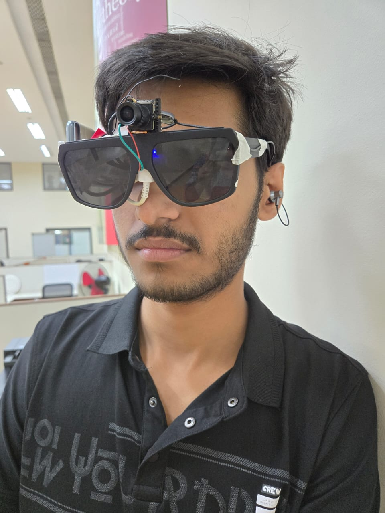
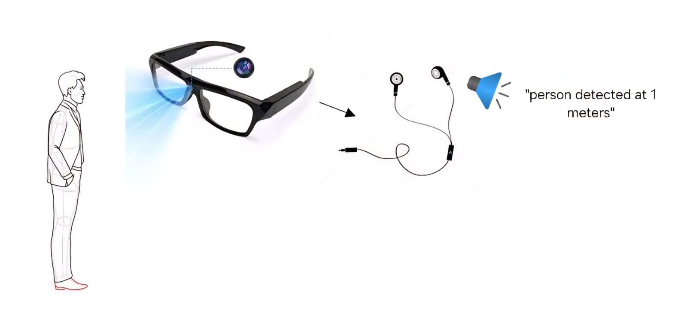
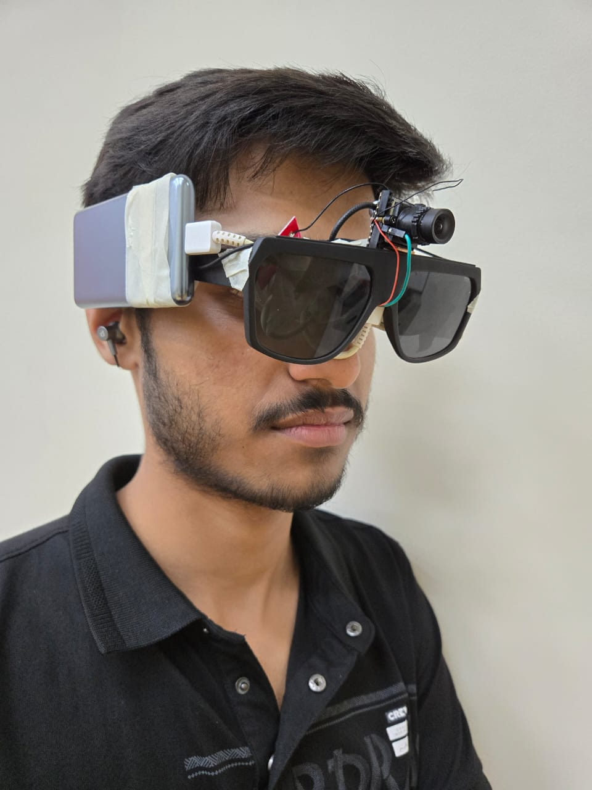
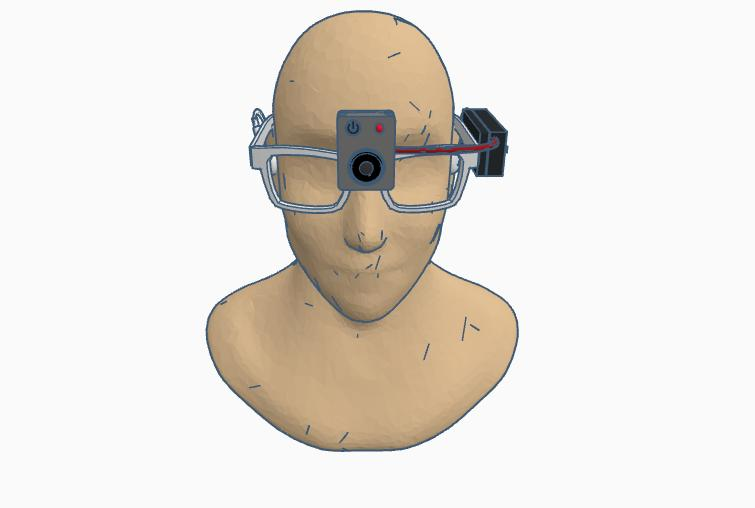
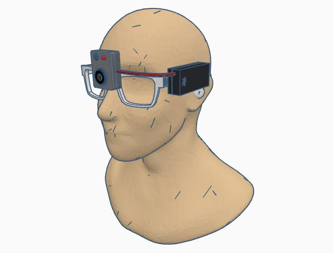
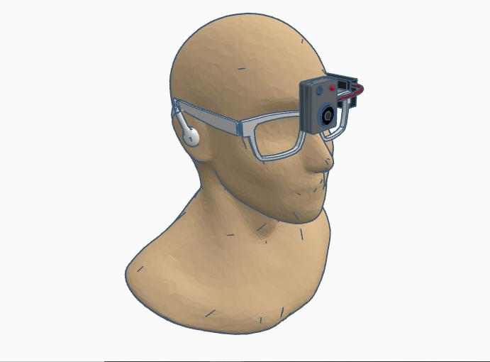

# RAFS-VI: Real-Time Auditory Feedback System for the Visually Impaired



[](LICENSE)


---

## Overview

RAFS-VI (Real-Time Auditory Feedback System for the Visually Impaired) is an embedded AI wearable designed to improve environmental awareness for individuals with visual impairments.

The system combines computer vision, monocular distance estimation, and offline speech synthesis to identify nearby objects and verbally communicate their identities and approximate distances in real time. All processing is performed locally on the device without requiring cloud services or an internet connection.

RAFS-VI is intended to function as an assistive awareness tool that complements traditional mobility aids by providing additional contextual information about the user's surroundings.

---

## Prototype

<p align="center">

</p>

The prototype integrates a forward-facing camera, embedded AI processor, rechargeable power supply, and speaker into a lightweight wearable eyeglass frame.

---

## Quick Facts

| Feature | Details |
|----------|---------|
| Platform | Sipeed MaixCam |
| Processor | RISC-V SoC with integrated NPU |
| AI Model | YOLOv11 Nano (.mud) |
| Framework | MaixPy |
| Camera | GC4653 |
| Distance Estimation | Calibration-based Monocular Vision |
| Audio Feedback | Offline MP3 Speech |
| Connectivity | None Required |
| Power | USB Power Bank / Li-Po Battery |
| Internet Required | No |

---

# Motivation

Independent navigation remains a significant challenge for many visually impaired individuals. Conventional mobility aids effectively assist with obstacle detection but generally provide limited semantic information regarding surrounding objects.

RAFS-VI addresses this limitation by integrating embedded artificial intelligence with wearable computer vision to recognize common objects, estimate their distances, and communicate the information through natural speech. The system operates entirely offline, enabling reliable use without dependence on external infrastructure.

---

# Key Features

- Real-time object detection using YOLOv11 Nano
- Embedded AI inference on Sipeed MaixCam
- Calibration-based monocular distance estimation
- Fully offline operation
- Natural speech feedback
- Lightweight wearable design
- USB Power Bank and Li-Po battery support
- Low-power embedded implementation

---

# System Architecture

<p align="center">

</p>

The overall processing pipeline consists of:

Camera

↓

YOLOv11 Object Detection

↓

Bounding Box Extraction

↓

Distance Estimation

↓

Decision Logic

↓

Offline Audio Feedback

Each detected object is processed sequentially. The firmware selects an appropriate voice prompt based on the detected class and estimated distance before generating spoken feedback for the user.

---

# Prototype Overview

The wearable prototype consists of:

- Sipeed MaixCam embedded AI module
- Forward-facing GC4653 camera
- Rechargeable power system
- Integrated speaker
- Mechanical push button
- Wearable eyeglass frame

Prototype photographs are available inside the `images/prototype/` directory.

---

# Hardware Overview

The hardware platform was designed to provide portable, self-contained operation while maintaining low power consumption suitable for wearable deployment.

Primary hardware components include:

- Sipeed MaixCam
- GC4653 Camera
- Speaker
- Push Button
- USB Power Bank
- Optional Li-Po Battery

Complete hardware documentation, wiring diagrams, and the Bill of Materials are provided in the `hardware/` directory.

---

# Embedded Firmware

The firmware is implemented using **MaixPy** and executes entirely on the MaixCam platform.

The embedded application performs:

1. Image acquisition
2. YOLOv11 inference
3. Object extraction
4. Distance estimation
5. Audio selection
6. Speech playback

All processing occurs locally on the embedded device without requiring network connectivity, enabling real-time operation while preserving user privacy.

# AI Model

RAFS-VI employs a quantized **YOLOv11 Nano** object detection model optimized for embedded inference on the Sipeed MaixCam platform.

The trained model is converted into the **`.mud`** format for deployment using the MaixPy runtime, enabling efficient execution on the integrated Neural Processing Unit (NPU). The model performs real-time object detection entirely on-device without requiring cloud-based processing.

Model-related resources, deployment files, and additional variants are available in the `models/` directory.

---

# Distance Estimation

Following object detection, RAFS-VI estimates the distance between the user and detected objects using a calibration-based monocular vision approach.

The estimation process utilizes:

- Camera intrinsic parameters
- Bounding-box measurements
- Experimentally derived calibration equations

Calibration was performed using controlled experiments and MATLAB curve fitting to improve estimation accuracy across practical operating distances.

Detailed calibration procedures, experimental data, and MATLAB resources are provided in the `calibrations/` directory.

---

# Audio Feedback

Detected objects are communicated to the user through natural speech generated from pre-recorded audio prompts.

The firmware:

- determines the detected object class,
- estimates its distance,
- selects the corresponding voice prompt,
- and plays the audio through the onboard speaker.

The repository includes both MP3 and WAV audio assets used for offline playback.

Audio resources are organized inside the `audios/` directory.

---

# Repository Structure

```
RAFS-VI/
│
├── audios/
├── cad/
├── calibrations/
├── firmware/
├── hardware/
├── images/
├── models/
├── paper/
├── patent/
│
├── .gitattributes
├── .gitignore
├── CITATION.cff
├── LICENSE
└── README.md
```

---

# Repository Modules

| Directory | Description |
|------------|-------------|
| **audios/** | Offline speech prompts used for audio feedback |
| **cad/** | Mechanical CAD renderings of the wearable prototype |
| **calibrations/** | Experimental calibration data, MATLAB scripts, and testbench |
| **firmware/** | Embedded MaixPy application implementing the complete processing pipeline |
| **hardware/** | Hardware documentation, BOM, wiring diagrams, and power configurations |
| **images/** | Architecture diagrams and prototype photographs |
| **models/** | YOLOv11 deployment models and supporting resources |
| **paper/** | Research paper and publication material |
| **patent/** | Patent publication and related documentation |

---

# Prototype Gallery

<p align="center">




</p>

Additional prototype photographs are available in the `images/prototype/` directory.

---

# CAD Renderings

<p align="center">







</p>

The CAD renderings illustrate the overall wearable assembly and complement the physical prototype.

---

# Patent

The concepts and system architecture presented in this repository are associated with the following published Indian patent application:

**A Smart Eye Glass Device for Assisting a Visually Impaired User and Its Method Thereof**

The official patent publication is available in the `patent/` directory.

---

# Research Paper

The accompanying research paper describing the system design, implementation, and experimental evaluation is available in the `paper/` directory.

---

# Citation

If you use RAFS-VI in your research, academic work, or derivative projects, please cite this repository using the information provided in `CITATION.cff`.

---

# License

This project is released under the **MIT License**.

See the `LICENSE` file for complete licensing information.

---

# Acknowledgements

This project was developed as part of research activities at **PES University**.

The authors gratefully acknowledge the guidance, technical support, and academic environment that made this work possible.

---

<p align="center">

**RAFS-VI**

*Real-Time Auditory Feedback System for the Visually Impaired*

*Embedded AI • Computer Vision • Wearable Assistive Technology*

</p>